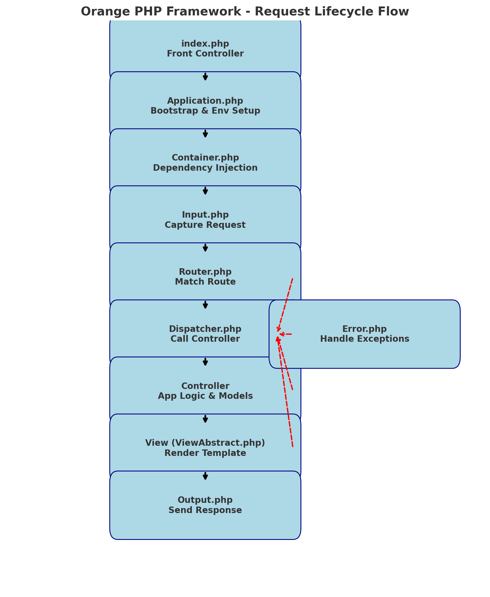

# Orange Framework #

The Orange MVC framework is not intended to replace other first-rate PHP frameworks, and although it has powered several sites, it is now primarily used to showcase my coding skills. 
It started as a proof-of-concept / dare from a customer. In which he challenged me to serve over 1,000 pages per second on a few Raspberry Pis. At the time, it was only running on Model 3s, but it could efficiently serve over 1,000 requests per second, which won me my first contract. 

It has been continually updated ever since. While I also work with other PHP frameworks, I would love to hear from you if this is the quality of code you are looking for or if you would like to learn more about this framework.

Overview: Web Page Generation Process (starting from index.php)

The framework follows a classic MVC request lifecycle. Here's the end-to-end flow:

---

1. Entry Point - index.php
  - This is the front controller. Every web request goes through it.
  - It bootstraps the framework by:
  - Defining the application root (__ROOT__).
  - Including the autoloaders (Composer + framework autoloader).
  - Instantiating the framework via Application::http($config).
  - After this handoff, the framework takes over.

---

2. Bootstrapping - Application.php
  - Initializes environment
  - Loads .env values, constants, and configuration.
  - Sets PHP environment (errors, timezone, charset).
  - Initializes the DI Container (Container.php)
  - Loads service definitions (logger, input, output, router, dispatcher, etc.).
  - Injects configuration into the container.
  - Starts HTTP lifecycle
  - Triggers events (before.router, before.controller, etc.).
  - Delegates request flow to the Router.

---

3. Request Input - Input.php
  - Captures all request data (GET, POST, FILES, SERVER, raw body).
  - Determines request type (HTML, AJAX, CLI) and method (GET, POST, etc.).
  - Provides unified access ($input->post('id'), $input->get('search'), etc.).

---

1. Routing - Router.php
  - Matches the current request URI + HTTP method to a registered route.
  - Route specifies:
    - Controller class.
    - Method to call.
    - URL parameters.
  - If no route matches - forwards to Error.php for 404 handling.

---

5. Dispatching - Dispatcher.php
  - Takes the matched route from the router.
  - Instantiates the controller (with dependencies from the container).
  - Calls the specified method, passing in any arguments from the URL.
  - Expects a string response (usually HTML or JSON).
  - Throws exceptions if:
    - Controller not found.
    - Method not found.
    - Invalid return type.

---

6. Controller & Model Layer
  - The controller method is the developer's code. It:
    - May load data from a model (database, business logic).
    - Prepares variables for the view.
    - Calls the view renderer (via View class extending ViewAbstract.php).
    - Models if used are plain PHP classes handling data access.

---

1. View Rendering - Class Extending ViewAbstract.php
  - Locates a template file (views/ directory).
  - Injects data ($data container).
  - Renders it into a string of HTML or other.
  - Supports aliases, dynamic view paths, and string rendering.

---

1. Output Handling - Output.php (referenced earlier)
  - Collects the final content string.
  - Sets response headers (Content-Type, Charset).
  - Applies HTTP response code (200, 404, 500, etc.).
  - Handles redirects and HTTPS enforcement if needed.
  - Sends the response to the client (echo) and terminates the script.

---

9. Error Handling - Error.php
  - If any uncaught exception occurs during the lifecycle:
  - Catches the exception.
  - Determines the correct error view (e.g., 500.php, 404.php).
  - Falls back to raw output (JSON for AJAX, Text for HTML, plain for CLI).
  - Sends the error response via Output.php.

---

1.  Logging & Events - Log.php / Event.php
  - Log.php
    - Records messages at various severity levels (error, info, debug).
    - Supports file-based or PSR-3 compatible loggers.
  - Event.php
    - Provides hooks like before.router, after.controller, etc.
    - Allows adding middleware or cross-cutting concerns (auth, CORS, caching).

---

### High Level Flow:

index.php - Application - Container - Input
          - Router - Dispatcher - Controller - View - Output
                                   - Error (if exception)

---

- Recommendation: Think of it as a pipeline:
  1.  index.php boots
  2.  Application sets environment
  3.  Input reads request
  4.  Router matches
  5.  Dispatcher executes controller
  6.  View renders
  7.  Output sends
  8.  Error catches failures.

---

# Orange PHP Framework - File Overview Documentation

This document provides a high-level overview of the main files in the Orange PHP MVC framework and their roles in the request lifecycle.

Entry Point

index.php
    Acts as the front controller.
    Defines the root path and loads autoloaders.
    Bootstraps the application by calling Application::http($config).
    All web requests pass through this file.

### Core Framework Classes

Application.php
    The framework bootstrapper.
    Loads environment variables, constants, and configuration.
    Initializes the Dependency Injection (DI) Container.
    Starts the HTTP lifecycle and triggers framework events.
    Directs control to the Router.

Container.php
    Implements the Dependency Injection container.
    Registers, manages, and resolves services.
    Supports closures, singletons, and auto-wiring.
    Provides services like router, dispatcher, input, output, logger.

Config.php
    Central configuration manager.
    Loads config files from multiple directories.
    Merges environment-specific overrides.
    Provides easy access to config values via object or array syntax.

Data.php
    A shared data container for application state.
    Extends SingletonArrayObject to allow array- and property-style access.
    Used for storing request/response data and variables passed to views.

Event.php
    Implements the framework's event system.
    Allows registration of listeners for triggers like before.router, before.controller, before.output.
    Executes listeners with priority-based ordering.
    Enables extensibility without modifying core code.

Dispatcher.php
    Executes the controller method defined by the router.
    Instantiates controllers with DI container.
    Passes route parameters to the controller method.
    Ensures return values are valid (must be string output).

Input.php
    Handles all incoming request data.
    Normalizes GET, POST, FILES, SERVER, and raw body.
    Detects request type (HTML, AJAX, CLI) and HTTP method.
    Provides helper methods to safely access input values.

Output.php
    Manages response content and headers.
    Sets status codes, content type, and charset.
    Handles redirects and HTTPS enforcement.
    Sends the final response to the client.

Error.php
    Centralized error and exception handler.
    Captures uncaught exceptions and error codes.
    Loads error views if available, otherwise falls back to raw output.
    Sends appropriate HTTP response codes (404, 500, etc.).

Log.php
    Provides a logging service.
    Implements PSR-3 LoggerInterface for compatibility.
    Supports file-based logging or external logging handlers.
    Logs framework and application-level events, errors, and debug info.

ViewAbstract.php
    Base class for view rendering engines.
    Manages view paths, aliases, caching, and dynamic view resolution.
    Provides consistent rendering API (render(), renderString()).
    Used by concrete view implementations (e.g., PHP templates).

Security.php
    Provides cryptographic utilities.
    Encryption/decryption, key management, and HMAC signatures.
    Secure password hashing and verification (Argon2).
    Input sanitation (filenames, invisible characters).
    Request Lifecycle Summary

---

index.php - All requests enter through the front controller.
Application.php - Bootstraps the environment and container.
Input.php - Captures request data.
Router.php - Matches URI + method to a route (not shown above but critical).
Dispatcher.php - Calls the controller action.
Controller - Application logic, retrieves data via models.
View (ViewAbstract) - Renders template with provided data.
Output.php - Sends final response to client.
Error.php - Handles errors/exceptions if encountered.

---

## Supporting Services
Event.php - Adds extensibility hooks.
Log.php - Provides system logging.
Security.php - Ensures secure cryptographic handling.
Data.php - Shared data storage for request lifecycle.

---

## Big Picture
These files work together to implement a lightweight MVC framework. Requests are funneled through index.php, processed by the core (Application, Router, Dispatcher), passed to controllers and views, and finalized by Output. Along the way, supporting services (Config, Container, Event, Log, Security, Data) provide structure, security, and extensibility.

---

## Unit Testing

You can run the base Orange Framework UnitTests, which are at

/packages/orange/bin/tests/runUnitTests.sh

This unit tests the base framework classes.
Everything is built upon this. If one or more of these fail, then there is a good chance that other features will fail.

You can review the output here: https://github.com/ProjectOrangeBox/Orange2023/blob/main/packages/orange/bin/tests/results.txt

## Setup

I used PHP 8.2 but have yet to test it for backward compatibility. Fortunately, the framework consists of only a few classes, so resolving any incompatibilities with an older version of PHP should be straightforward.

Don't forget to run `composer install`

Remember to add a .env file at the root of your project. Even an empty `.env` file works.

A sample .env has been provided in ./support/samples/sample.env

The .env file is in [.ini format](https://en.wikipedia.org/wiki/INI_file)

## An HMVC structure has been provided inside /application

/application/people

/application/rest

/application/shared

/application/welcome

You could also configure Orange to have everything in a single application directory.

## Recommended

For handling Dates

Carbon - A simple PHP API extension for DateTime.

https://carbon.nesbot.com/

https://github.com/briannesbitt/carbon

For handling Migrations

Phinx - PHP Database Migrations For Everyone.

https://phinx.org/

[Overview](overview.md)

